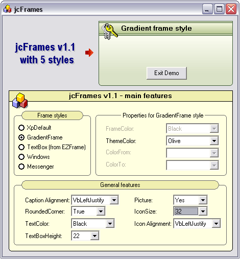



## jcFrames \(new frame control\)

### Description

The jcFrames control (NEW VERSION!!!!!!!) will enable you to have new designs on your vb projects. This control provides 5 styles (including Windows XP style) for your frames and different features (caption aligments, textcolor, fillcolor, iconsize, picture, etc.).

Version 1.1 incorporates icon alignment and fixs errors of previous version.

Thanks to Jim K for doing the initial idea of the usercontrol using my job posted to PSC. Thanks to ElectroZ for his frame style used here as TextBox style.
 
### More Info
 

             |
---                |---
**Submitted On**   |2005-12-30 00:20:36
**By**             |[Juan Carlos San Román](https://github.com/Planet-Source-Code/PSCIndex/blob/master/ByAuthor/juan-carlos-san-rom-n.md)
**Level**          |Intermediate
**User Rating**    |5.0 (159 globes from 32 users)
**Compatibility**  |VB 5\.0, VB 6\.0
**Category**       |[Custom Controls/ Forms/  Menus](https://github.com/Planet-Source-Code/PSCIndex/blob/master/ByCategory/custom-controls-forms-menus__1-4.md)
**World**          |[Visual Basic](https://github.com/Planet-Source-Code/PSCIndex/blob/master/ByWorld/visual-basic.md)
**Archive File**   |[jcFrames\_\(19606812302005\.zip](https://github.com/Planet-Source-Code/juan-carlos-san-rom-n-jcframes-new-frame-control__1-63827/archive/master.zip)

